# Research Questions

- How did shale gas shock affect education, income, and other living standards (was there a dutch disease)

# Methodologies

## Notes

 - For education, I included age 18-25 individuals to the sample
 - For income, I included age 18-40 individuals to the sample

## Synthetic Control

 - Control variables for donor pool: `predictors = c("white_ratio", "black_ratio", "asian_ratio", "hispanic_ratio",  "youth_ratio","population")`

### Trial (1)
First, I tried SCM with Texas as the treatment group.
Without consideration of other shale-gas states like Oklahoma or Penn, I had the following results.

**Education**

:::: {layout="[ 50, 50 ]"}

::: {#scm-male-edu}

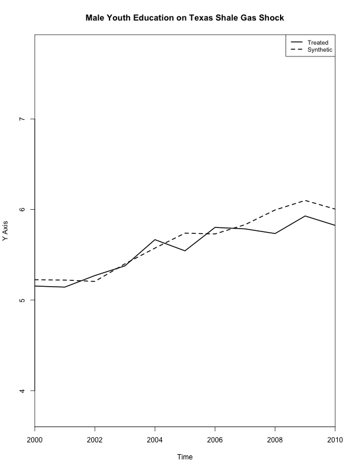

:::

::: {#scm-female-edu}
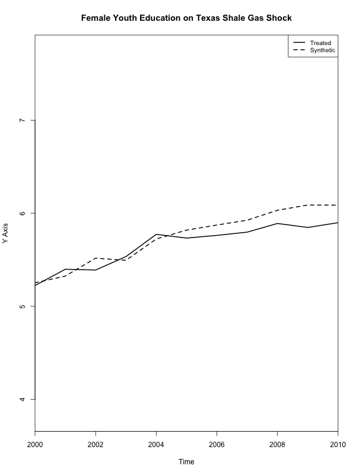
:::

::::

- In both genders, we find a slight decrease in the avg. years of education, but in a very modest degree.

**Income**

:::: {layout="[ 50, 50 ]"}

::: {#scm-male-income}

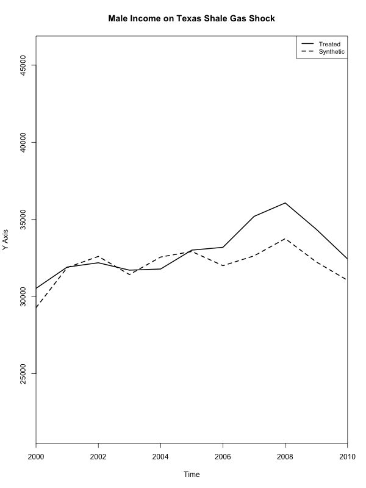
:::

::: {#scm-female-income}
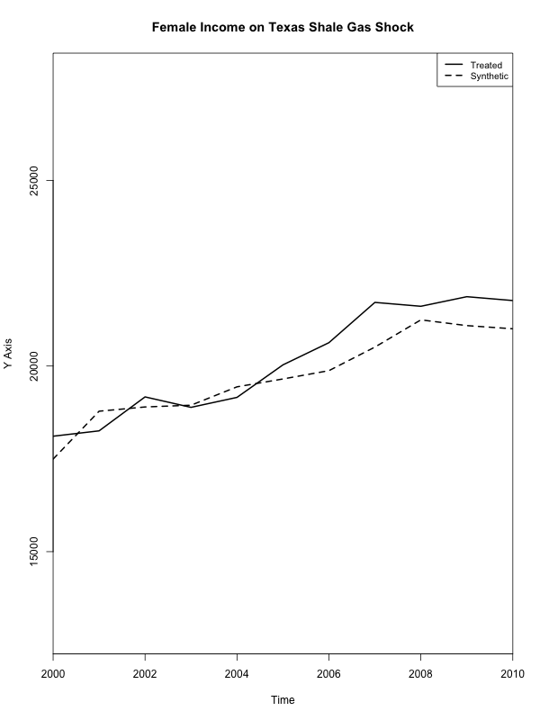
:::

::::

- In both genders, we find a slight increase in the avg. income, but in a very modest degree.

### Problems with Trial (1)

1. Placebo test results are so bad. For example, in education,

:::: {layout="[ 50, 50 ]"}

::: {#scm-male-edu-placebo}

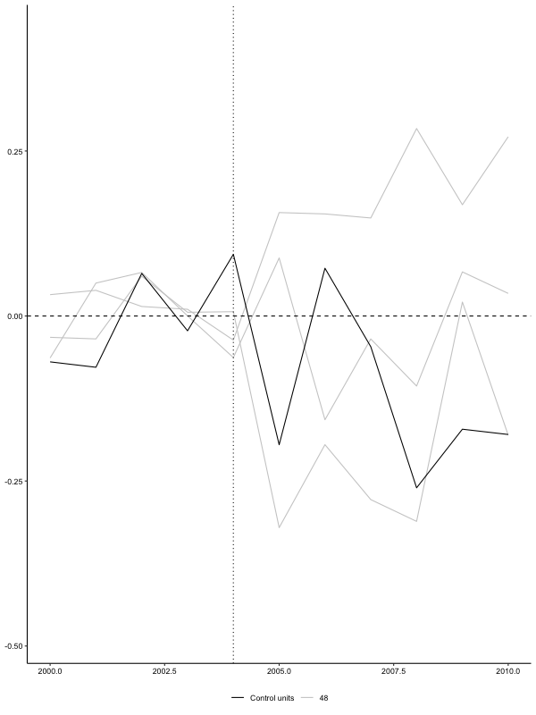

:::

::: {#scm-female-edu-placebo}
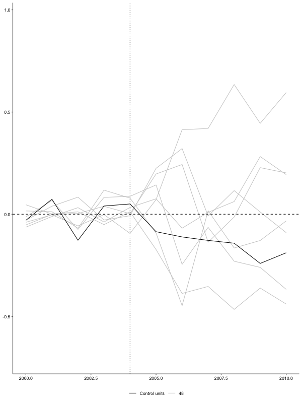
:::

::::

:::: {layout="[ 50, 50 ]"}

::: {#scm-male-edu-mspe}

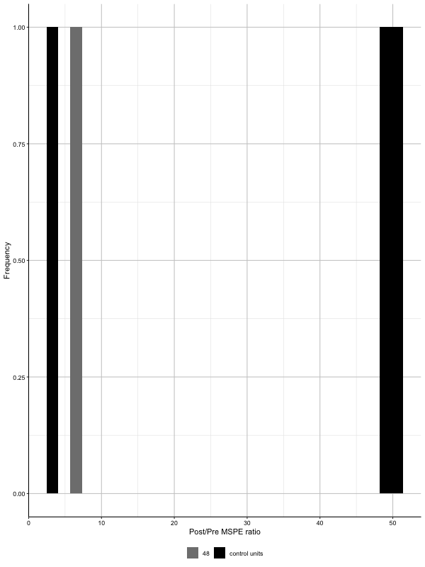

:::

::: {#scm-female-edu-placebo}
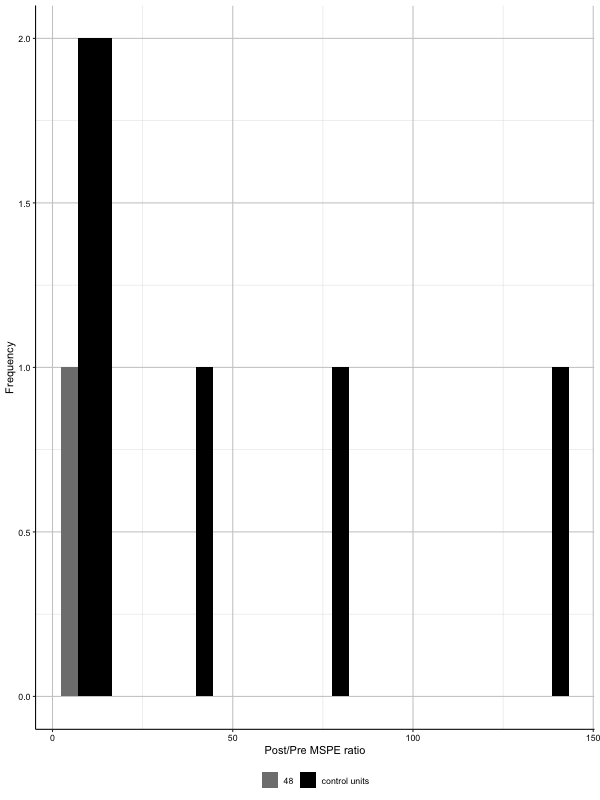
:::

::::

- Note: A good MSPE test result should have the treated (gray) column on the far right.

2. I didn't account for other states with shale gas activity.

### Trial (2)

In trial (2), I excluded other states with shale-gas activity.

Results are unsatisfactory:

- Even the slightest amount of different trends between SC and treated disappeared
- Placebo tests are not working well.

For example, the average income effect is as follows:

:::: {layout="[ 50, 50 ]"}

::: {#scm-income-trial2}

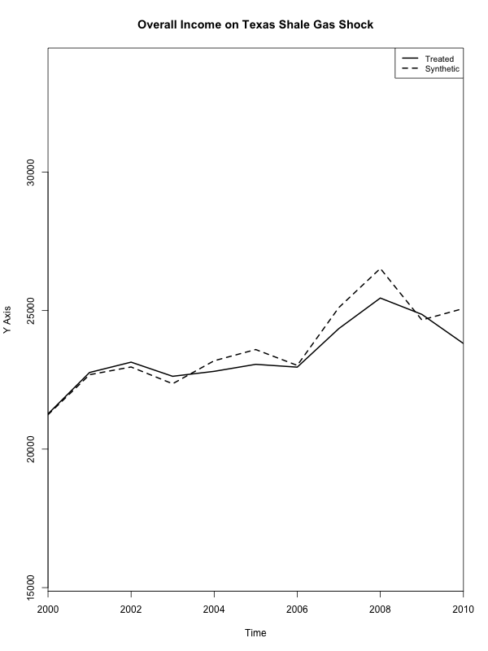

:::

::: {#scm-income-trial2-placebo}
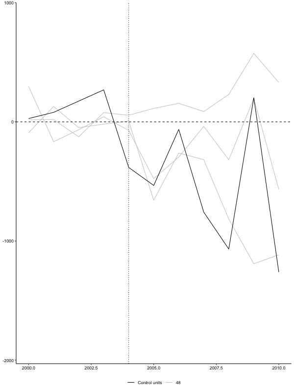
:::

::::

## DID

Although I did not have a straight DID now, I made plots equivalent to DID analyses.

This looks a bit more satisfying:

### Overall Effect

::: {layout="[ 50, 50 ]"}

::: {#did-schlyears}

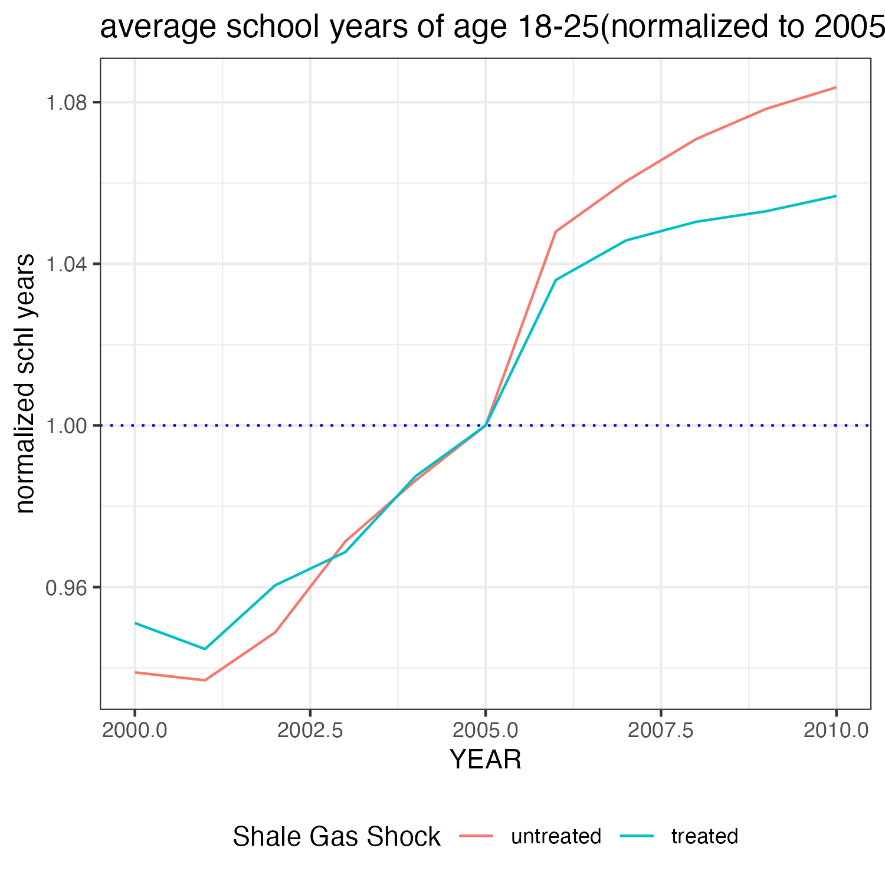

:::

::: {#did-income}
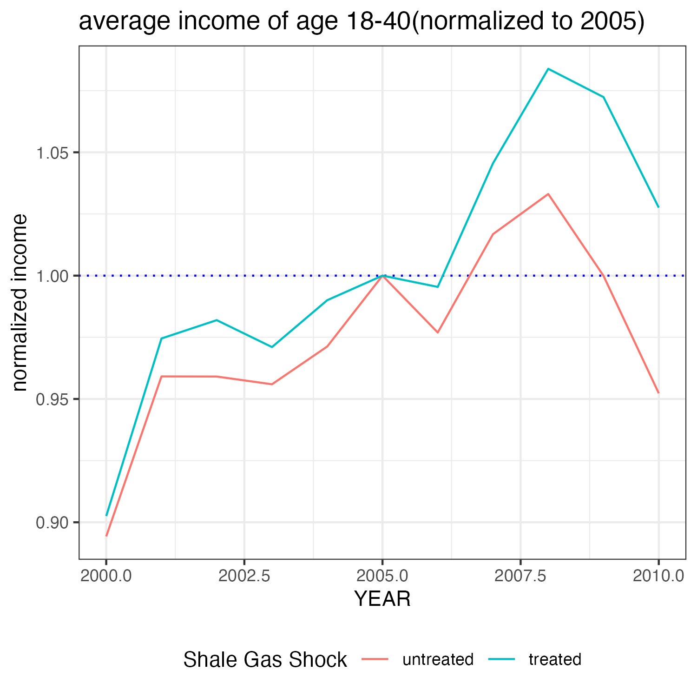
:::

::::

### By sex
::: {layout="[ 50, 50 ]"}

::: {#did-schlyears-by_sex}

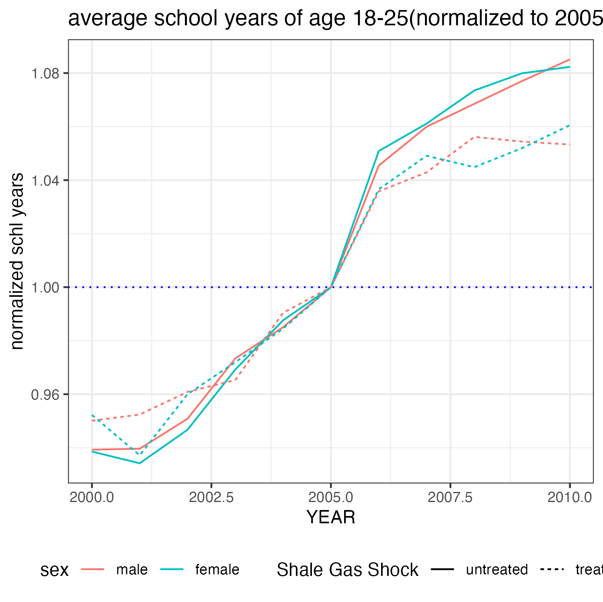

:::

::: {#did-income-by_sex}
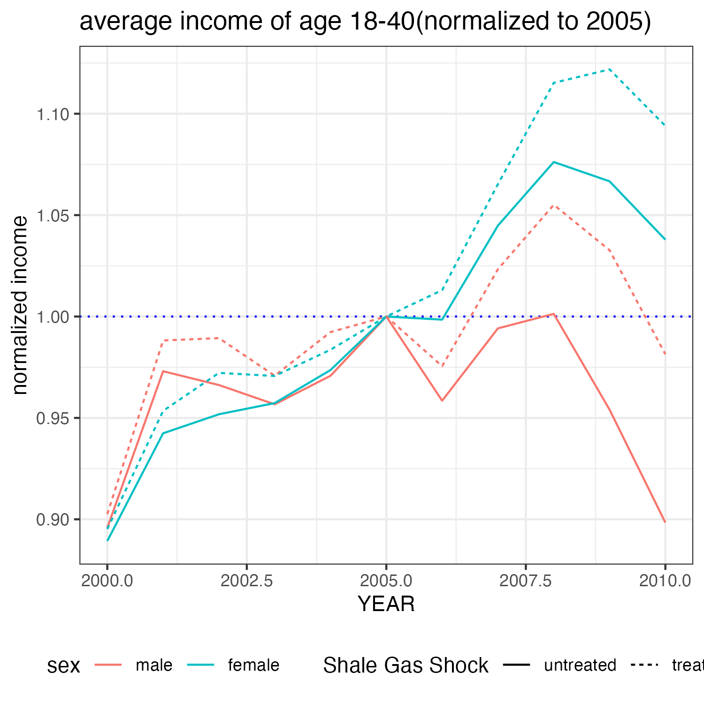
:::

::::

# To-dos

 - Formally rerun DID
 - Search for any individual-level panel data with **state**, **year(2000-2010)**, **sex**, **age** information. It'd be better if it includes **education**, **income**, **labor market participation**.
 - Extend our question: 
    + Heterogeneous Effects on men and women? Why? For example, male income decreased in nonshale states.
    + What are the channels of the income/education effects?
    + Why did SCM do bad but DID do great? Econometric and causal inference-based answers

# Code Directory
- Synthetic control: 
    + trial (1) : final-project/code/scm.r
    + trial (2) : final-project/code/scm-2.R

- DID: final-project/code/did-with-panel.r

